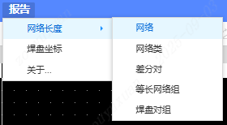

# 导出等长网络长度

## 功能概述

本扩展用于基于当前 PCB 设计，导出指定高速网络的长度信息和焊盘坐标信息。支持以下内容的导出：

-   网络
-   网络类
-   差分对
-   等长网络组
-   焊盘对组
-   焊盘坐标

导出格式为CSV文件，单位包括mil和mm。

默认排序规则为：首先按网络类名称正序排列，其次按网络长度从长到短排列。

### 文件内容示例

1. **网络**

    ```
    Net,Net Length(mil),Net Length(mm)
    ```

2. **网络类**

    ```
    Net Classes,Net,Net Length(mil),Net Length(mm)
    ```

3. **差分对**

    ```
    Differential Pair,Net,Net Length(mil),Net Length(mm)
    ```

4. **等长网络组**

    ```
    Equal Length Group,Net,Net Length(mil),Net Length(mm)
    ```

5. **焊盘对组**
    ```
    Pads Pair Group,Pads Pair,Net Length(mil),Net Length(mm)
    ```

6. **焊盘坐标**
    ```
    Component,Designator,X1(mil),Y1(mil),X1(mm),Y1(mm)
    ```

## 操作界面

用户可以通过顶部菜单栏访问以下功能：



-   PCB页面 > 报告 > 网络长度 > 网络
-   PCB页面 > 报告 > 网络长度 > 网络类
-   PCB页面 > 报告 > 网络长度 > 差分对
-   PCB页面 > 报告 > 网络长度 > 等长网络组
-   PCB页面 > 报告 > 网络长度 > 焊盘对组
-   PCB页面 > 报告 > 焊盘坐标

## 焊盘坐标功能使用方法

焊盘坐标导出功能使用方法：

1. 在PCB画布上选中需要导出坐标的焊盘
2. 点击菜单：PCB页面 > 报告 > 焊盘坐标
3. 系统会自动检测已选中的焊盘并导出坐标信息

如果没有选中焊盘，系统会提示"请先在画布上选择焊盘"
